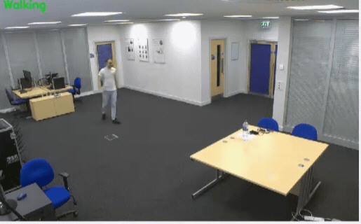

# Sistema de Monitoreo para el Cuidado de Adultos Mayores

Este proyecto consiste en un sistema de monitoreo diseñado para el cuidado de adultos mayores. Utiliza la biblioteca Mediapipe de Python para extraer keypoints mediante estimación de pose a partir de videos del conjunto de datos NTU RGB + D. Estos keypoints se utilizan para predecir acciones humanas, lo que permite detectar situaciones de riesgo como caídas. En caso de una experiencia negativa, como una caída, el sistema envía una alerta a una página web donde el usuario o cuidador puede monitorear la situación.


## Funcionalidades Principales

- Extracción de keypoints de videos utilizando la biblioteca Mediapipe.
- Predicción de acciones humanas utilizando un modelo de deep learning.
- Alertas en tiempo real en caso de experiencias negativas, como caídas.
- Interfaz web para monitorear las alertas y la situación del usuario.

## Estructura del Proyecto

El proyecto está estructurado de la siguiente manera:

- **DATASET/**: Contiene el conjunto de datos NTU RGB + D
- **DATA/**: Contiene los archivos generados durante el preprocesamiento.
- **TrainedModels/**: Contiene el modelo de deep learning utilizado para la predicción de acciones.
- **templates/**: Contiene  la implementación de la interfaz web.
- **requirements.txt**: Archivo de requerimientos con las dependencias del proyecto.

## Instalación y Uso

1. Clona este repositorio:

    ```bash
    git clone https://github.com/JesusCK/Monitoring-System-for-Elderly-People.git
    ```

2. Instala las dependencias del proyecto:

    ```bash
    pip install -r requirements.txt
    ```

3. Ejecuta el sistema:

    ```bash
    python app.py
    ```

4. Accede a la interfaz web desde tu navegador: [http://localhost:8000](http://localhost:8000)

5. Acceso a Google Colab

Puedes acceder a una versión interactiva del proyecto en Google Colab haciendo clic en el siguiente enlace:

[](https://colab.research.google.com/drive/1lnLDkegFffftfbCZJW0GeD62ZQaM6aSv?usp=sharing)

## Contribución

Si deseas contribuir a este proyecto, sigue estos pasos:

1. Haz un fork del repositorio.
2. Crea una nueva rama para tu funcionalidad: `git checkout -b nueva-funcionalidad`.
3. Realiza tus cambios y haz commit: `git commit -m "Agrega nueva funcionalidad"`.
4. Haz push a la rama: `git push origin nueva-funcionalidad`.
5. Envía un pull request.

## Créditos

Este proyecto fue desarrollado por [Maria Camila Gomez y Jesús Quiroz ](https://github.com/JesusCK).


